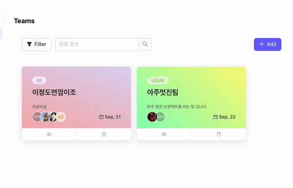

# 토이프로젝트 3조 이정도면껌이조

**패스트캠퍼스 X 야놀자 프론트엔드 부트캠프 토이프로젝트 3조**

> 팀장: 박나영  
> 팀원: 김미정, 김성겸, 노욱진, 진종수

## 📖 직원들을 위한 위키 사이트 (FE3.WIKI)

**배포 주소 [https://dazzling-cheesecake-99fc5f.netlify.app/](https://dazzling-cheesecake-99fc5f.netlify.app/)**

마크다운 문법을 사용해서 팀원 들이 같이 공유할 수 있는 위키를  
열람하고 수정할 수 있는 웹 애플리케이션 입니다.

또한 회원가입/로그인 기능을 사용해서 직원 정보를 관리할 수 있으며  
팀 프로젝트 또한 관리 가능한 위키 사이트 입니다.

### 개발 환경 및 배포

    
   

### 사용 기술

      

### 협업툴

   

## 🎯 주요 구현 사항

<!-- 각자 구현 사항 적어주시면 좋을것 같아요! -->

1. 회원가입 페이지
   - 구글 아이디 및 이메일로 회원가입 구현
1. 로그인 페이지
   - 구글 아이디 및 이메일로 로그인 구현
1. 회원 정보 입력 페이지
   - 웹 서비스에서 사용할 유저 정보 DB에 CRUD 구현
   - 재로그인 시 유저 기존 정보 보이기 구현
   <!-- 여기까지 종수님 구현 사항 -->
1. 출퇴근 타이머
   - 오늘 날짜 및 현재 시간 표시
   - 출퇴근 시간 기록
   - 총 근무시간 체크(기록된 출퇴근 시간 기반)
   - 출퇴근 상태에 따라 안내문구 표시
1. 출퇴근 기록 페이지
   - 출퇴근 기록 리스트: 나의 출퇴근 기록 및 내가 속한 팀원들의 출퇴근 기록 확인, 날짜 순으로 정렬 가능
   - 출퇴근 기록 캘린더: 나의 출퇴근 기록을 일자별로 출력
   <!-- 여기까지 미정님 구현 사항 -->
1. 위키 페이지

   - 비로그인 유저도 글을 작성할 수 있는 전체 위키와 로그인 유저가 팀 활동을 할 수 있는 팀 위키를 구분해서 구현했습니다.
     - 전체 위키
       - 비로그인, 로그인 유저 모두 익명으로 CRUD가 가능하게 구현했습니다.
       - 가이드 폴더를 제외하고 폴더/파일의 권한은 모두에게 열려있도록 설정했습니다.
     - 팀 위키
       - 로그인시 로컬스토리지 값을 가져와서 팀 위키와 연동시켰습니다.
       - 팀 위키에서 파일을 작성할 때, 가져온 데이터를 통해 작성자의 정보를 렌더링 했습니다.
     - 전체 위키, 팀 위키 공통 - 리액트 정렬 라이브러리(react-beautiful-dnd)를 적용해 폴더들의 순서를 변경할 수 있도록 구현했습니다.
     <!-- 여기까지 욱진님 구현 사항 -->

1. 프로젝트 페이지

   - (로그인 시) 내 팀 프로젝트 칸반 보드
     - 내가 속한 팀 프로젝트를 예정됨/진행중/완료된으로 상태를 자유롭게 변경하는 기능
     - 각 상태의 칸반 보드에서 순서를 위아래로 변경하는 기능
   - 전체 프로젝트 조회
     - 진행상황/팀별/멤버별 필터링 기능
     - 프로젝트 상세 정보 조회
   - 프로젝트 수정/삭제 기능
   <!-- 여기까지 내 구현 사항 -->

1. 직원 정보 페이지
   - 직원 정보 추가/삭제/수정 기능
   - 직원 목록을 바탕으로 팀 생성 및 팀삭제 수정 기능
   - 권한별로 기능에 제한을 둠
   <!-- 여기까지 나영님 구현 사항 -->

## 🖥️ 팀원 소개 및 구현 화면

### 💪 이정도면 껌이조! 우리 팀을 소개 합니다.

| **이름** | **직책** |                **담당 페이지**                |               **프사**                |
| :------: | :------: | :-------------------------------------------: | :-----------------------------------: |
|  박나영  |   팀장   |              임직원 페이지 담당               |  |
|  김미정  |   팀원   | 출퇴근 타이머 <br /> 출퇴근 기록 페이지 담당  |  |
|  김성겸  |   팀원   |    프로젝트 페이지 <br />메인 페이지 담당     |  |
|  노욱진  |   팀원   |               위키 페이지 담당                |  |
|  진종수  |   팀원   | 로그인/회원가입 <br />회원 정보수정 관련 담당 |  |

### 페이지 구현 이미지

|                   **메인 페이지**                   |                                                     **로그인/회원가입 페이지**                                                      |
| :-------------------------------------------------: | :---------------------------------------------------------------------------------------------------------------------------------: |
|  |   |

|                 **정보 수정 페이지**                  |                 **직원정보 페이지**                 |
| :---------------------------------------------------: | :-------------------------------------------------: |
|  |  |

|                  **위키 페이지**                  |                 **프로젝트 페이지**                  |
| :-----------------------------------------------: | :--------------------------------------------------: |
|  |  |

|                 **출퇴근 타이머**                 |                  **출퇴근 기록 페이지**                   |
| :-----------------------------------------------: | :-------------------------------------------------------: |
|  |  |

<!-- 각자 구현 사항 적어주시면 좋을것 같아요! -->

<!-- 로그인 / 회원가입 / 정보 수정 구현 사항 -->

### 로그인 / 회원가입 / 유저 정보 입력

#### <b> 로그인 페이지 </b>


</br>
소셜 로그인 및 이메일 로그인 두 가지 방법으로 로그인을 구현 했습니다. </br></br>
DB에 이미 해당 계정의 정보가 있을 때와 없을 때를 구분해서 없을 때만 정보 입력 페이지로 가게 했습니다. </br></br>
recoil-persist 를 사용해 사용자 로그인 상태를 파악하고 유지하게 했습니다.

#### <b>유저 정보 입력 페이지</b>


내 정보 수정 버튼을 눌렀을 때 기존 정보가 보여 수정을 용이하게 하였습니다 </br></br>
유저 정보 입력 시 팀 정보는 DB의 저장된 팀 정보만 보이게 하였습니다.

<!-- 직원 정보 구현 사항 -->

### 직원 정보

**직원 정보 페이지**
직원 정보를 관리하는 페이지 입니다.  
직원 주소록과 정보를 한 눈에 보여주고자 테이블 형태로 구현했습니다.

- 직원 추가 삭제 및 수정이 가능합니다.
- 권한을 admin / member로 두어 권한에 따라 기능을 이용할 수 있습니다.
- 팀 선택 시 팀페이지와 연동되어, 팀 구성원으로 등록되도록 연결했습니다.
- 검색과 필터링, 정렬 기능으로 직원 이름, 부서를 손 쉽게 찾을 수 있도록 했습니다.
- 데이터를 불러올 때 스켈레톤 ui를 적용해 사용자의 이탈을 막고자 했습니다.
  <br />


<br />

**팀 리스트 페이지**  
직원 정보와 연동된 팀 리스트 페이지 입니다.

- 팀 추가 삭제 및 수정이 가능합니다.
- 유저 삭제 시 팀원 목록에서도 삭제되로록 양방향으로 데이터를 읽고 쓰고자 구현했습니다.
- 이미 팀이 있는 유저는 유저목록에서 제외되도록 필터링 처리 했습니다.

  <br />

  

  <br />

### 위키 페이지

## <!--` 프로젝트 사항 -->`

<br />

#### 전체 위키


전체 위키에서는 다음과 같이 비로그인, 로그인 유저 모두 익명으로 CRUD가 가능하게 구현했습니다.

유저 정보는 익명이므로 파일에 표시되지 않도록 설정했습니다.

#### 팀 위키


팀 위키는 로그인 유저가 해당하는 팀의 위키에서만 CURD가 가능하도록 구현했습니다.

유저는 익명이 아니므로 파일에 정보가 표시되도록 설정했습니다.

#### 드래그 앤 드롭


전체 위키와 팀 위키 모두 드래그 앤 드롭으로 폴더의 위치를 정렬 가능하도록 구현했습니다.

### 프로젝트 페이지

**칸반 보드 기능**

노션에서 칸반 보드를 사용해서 프로젝트를 관리하는 기능이 매우 편리해 보여서  
react-beautiful-dnd라는 라이브러리를 사용하여  
드래그 & 드롭 기능으로 보드 끼리 자유롭게 순서와 위치를 변경하는 기능을 구현하여
조금 더 손 쉽게 프로젝트 진행 상황을 변경할 수 있게 하였습니다.


<br />

**프로젝트 필터링 기능**

어느팀, 어느 담당자가 어떤 일을 했는지 조금 더 쉽게 찾게 하고 싶어서  
담당자 / 팀명 / 상태 필터링 기능을 구현 하였습니다.

Array.prototype.filter 메서드를 사용하여  
조건에 맞는 배열을 렌더링하는 방식으로 구현 하였습니다.


<!-- 출퇴근 구현 사항 -->

### 타이머 모달 및 출퇴근 페이지

1. 출퇴근 타이머
   
   - 오늘 날짜 및 현재 시간 표시
   - 출퇴근 시간 기록: 로그인 상태에서만 출퇴근 버튼이 동작하며, 해당 계정 기준 하루 1회만 출퇴근 기록이 가능하도록 하였습니다.
   - 총 근무시간 체크: 출근 버튼을 클릭한 순간부터 근무 시간 타이머가 작동하며, 퇴근 버튼을 누른 시점을 기준으로 총 근무 시간이 산출됩니다.
   - 출퇴근 상태에 따라 안내문구 표시: 출근 버튼을 눌렀을 때는 "좋은 하루 보내세요😊"라는 메시지가, 퇴근 버튼을 눌렀을 때는 "오늘도 수고하셨습니다!👍"라는 메시지가 출력됩니다.
1. 출퇴근 기록 페이지
   
   - 출퇴근 기록 리스트: 로그인 상태일때만 타이머 모달창 내에서 접근할 수 있습니다.  
     ㄴ 나의 출퇴근 현황: 현재까지 나의 모든 출퇴근 기록을 확인할 수 있으며, 날짜 및 시간 순으로 정렬이 가능합니다.
     ㄴ 우리팀 출퇴근 현황: 내가 속한 팀 멤버들의 모든 출퇴근 기록을 확인할 수 있으며, 날짜 및 시간 순으로 정렬이 가능합니다.
     
   - 출퇴근 기록 캘린더: 나의 일일 출퇴근 기록을 캘린더 형태로 확인할 수 있습니다.

## ➡️ 유저 흐름(flow) 이미지


## Git 브랜치 전략

| 용도      | 브랜치 명         |
| :-------- | :---------------- |
| 개발용    | deploy            |
| 메인      | main              |
| 기능 개발 | feature/#이슈번호 |

## 📂 폴더 구조

```
📦 fe3.wiki
├─ public - 정적 assets
│  ├─ images - 이미지
│  └─ profile - 프로필 사진
└─ src
   ├─ assets - 각종 assets
   ├─ components - 컴포넌트
   │  ├─ common - 공통 컴포넌트
   │  ├─ Employee - 직원정보
   │  ├─ Main - 메인 페이지
   │  ├─ project - 프로젝트 페이지
   │  ├─ SignIn - 로그인
   │  ├─ SignUp - 회원가입 / 정보수정
   │  ├─ Timer - 출퇴근 타이머
   │  ├─ Wiki - 위키 페이지
   │  └─ WorkTime - 출퇴근 기록
   ├─ constant - 상수들
   ├─ data - 개발용 데이터
   ├─ hooks - 커스텀 훅 폴더
   │  ├─ Employee - 직원정보
   │  ├─ Main - 메인 페이지
   │  ├─ project - 프로젝트 페이지
   │  ├─ SignIn - 로그인/회원가입/정보수정
   │  ├─ Timer - 출퇴근 타이머
   │  └─ Wiki - 위키 페이지
   ├─ layouts - 레이아웃 컴포넌트
   ├─ libs - 라이브러리 설정 폴더
   ├─ page - 라우팅으로 불러올 페이지
   ├─ router - 라우터 설정
   ├─ store - 전역 상태 관리
   ├─ styles - 스타일링을 위한 css 폴더
   └─ type - interface, type
```

©generated by [Project Tree Generator](https://woochanleee.github.io/project-tree-generator)

## 📦 설치 및 실행 방법

toast-ui-editor에서 지원하는 react 버전이 17버전까지라서  
`npm install`로 설치시 오류가 발생합니다.  
`npm install --legacy-peer-deps`로 설치 부탁드립니다.

실행 : `npm run start`로 서버를 실행할 수 있습니다.

### 파이어베이스 `.env`파일 구조

파이어베이스를 사용하기 위해서는  
루트 폴더에 `.env` 파일을 생성하여 아래 값들을 넣어주면 실행 가능합니다.

```
REACT_APP_API_KEY=api_key
REACT_APP_AUTH_DOMAIN=auth_domain
REACT_APP_PROJECT_ID=project_id
REACT_APP_STORAGE_BUCKET=storage_bucket
REACT_APP_MESSAGING_SENDER_ID=messaging_sender_id
REACT_APP_APP_ID=app_id
```
